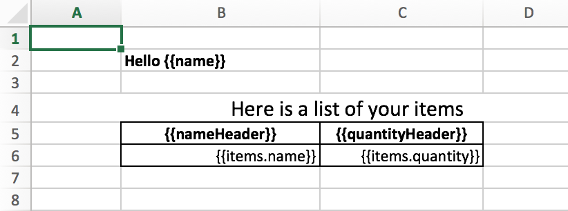

# $response.Excel

Method `$response.Excel()` renders report by provided template and writes it file into the body stream in a efficient way.

## Syntax

```
$response.Excel(template, context[, reportName])
```

## Parameters

### template
Path to template `.xlsx` file (string). Example template's content:



### context
Data to render (Javascript object)

### reportName
Filename for download (string, optional)

## Return value
`null` if success or string error if error.

## Example

```
$response.Excel("./template.xlsx", {"name": "John Smith"}, "report.xlsx")
```